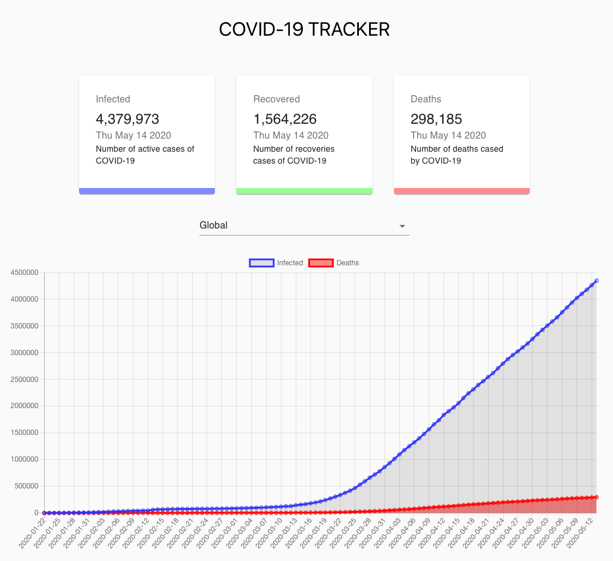

# React COVID-19 Tracker

  

Improved tracking Global infections, recoverys and deaths of COVID-19 using https://covid19.mathdro.id/api/

<b>Used: React, Charts.js and Material UI</b>

Credits to JavaScript Mastery Channel
